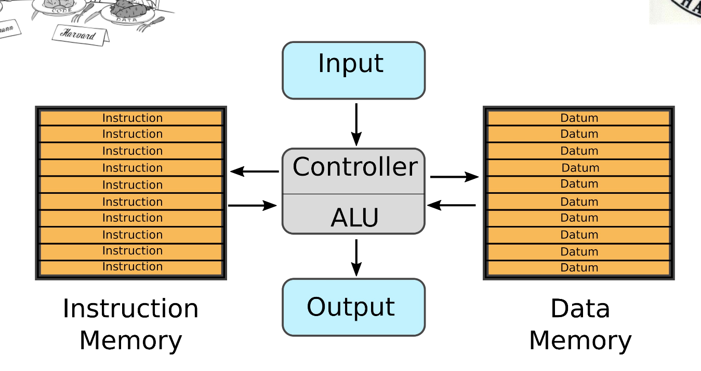
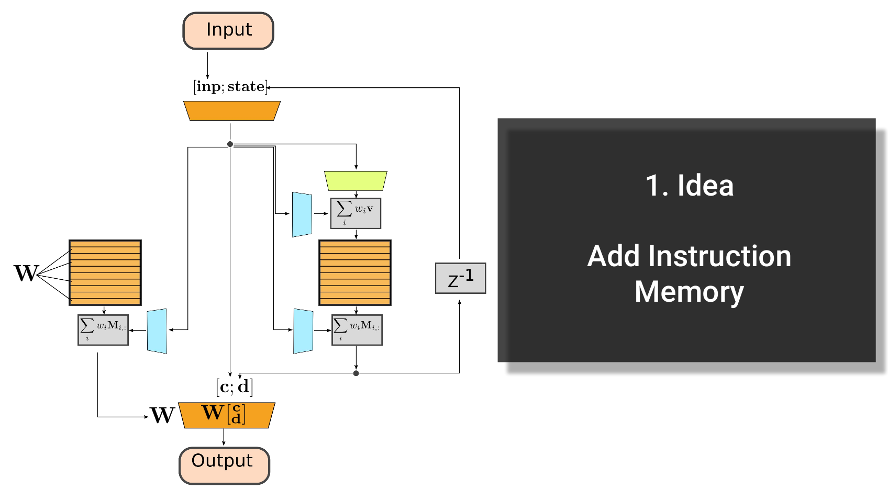

# Differentiable Neural Harvard Computer
This is the original implementation of a **Differentiable Neural Harvard Computer** (DNHC), also called **_Differentiable Harvard Machine Architecture_**, I developed as a side project during my PhD in 2018 when I was living in Arizona.

The general idea of a Differentiable Neural Computer (DNC), or Neural Turing Machine, is that the network has access to a memory to which it can write data and request it through. The original paper written by folks at Deepmind mentioned that one of the inspirations and motivations was to develop a neural Von-Neumann architecture.

A quick analysis I did back in 2018 raised actually the question if it is truly a von-Neumann architecture, because one of the defining properties of von-Neumann is a shared data and instruction memory. My main conclusion was, that at a conceptual level the memory actually only contains data but not instructions if we interpret the weights of a neural network as its instructions.

But having a single memory containing only data provokes the question if we can extend the (back then) current architecture and add an actual memory containing only instructions. This would extend the architecture to a Harvard-type of neural computer. The Harvard architecture was/is a competing architecture to von-Neumann in which the ALU (Algorithmic-Logic-Unit, or the CPU) has access to two **separate** memories: one contains only instructions, the second only data.



## Proposed architectures
I proposed two different potential design ideas which would extend the Differentiable Neural Computer to include an instruction memory.

### Simply adding an Instruction Memory
The first approach was to **just add an instruction memory** from which we can request rows or matrices (using addresses) and combine them with the original weight summarization scheme of the DNC. In other words, we use addresses to read rows/matrices from memory and add them up using weights to generate a weight matrix **W**. This weight matrix **W** can now be used in the final processing steps of the DNHC to create the output.


### Re-Create an ALU/CPU
The second, much more sophisticated, approach is to have in the final layers of the DHNC parallel computations with multiple weight matrices **Wi**. Now, we store in the instruction memory only the rows of weights which we use to combine all outputs **Wi * x** with softmax. In other words, the instruction memory stores now the information **how to combine** the different computations of the final stage to create the output.
The idea was here to replicate the actual implementations of ALUs in the computer: We have different modules which compute all in parallel (think like multiplication, addition etc) and we just have to select which computation/output we are actually interested in. This takes inspiration of how one would implement simple logic-circuits in FPGAs (using VHDL/Verilog etc) where we might do several computations in parallel during one clock cycle before we know which one we actually want to process further.
.")

### Fixed versus flexible Instructions
All architectures proposed above had two different ways of how we could implement the instruction memory: The most straight forward and easiest approach would be to **learn** the instruction memory. This means the instruction memory would be a large tensor which is a trainable variable in Tensorflow/PyTorch.

The second approach would be to have actually a flexible instruction memory in which we can write and read at the same time such that we can update instructions throughout the computational cycle as needed.

## Okay cool, but why would we be interested in this? What is the merit?
Obviously, training Differentiable Neural Computer and Differentiable Neural Harvard Computer requires a lot of computation and training data. Especially having all the different networks for addressing, reading and the additional instruction memory means the number of parameters to train becomes quite large.

The imagined goal of the Differentiable Neural Harvard Architecture is to be especially suitable for Multi-Task scenarios. For example, you could imagine the DNHC to learn task-specific heads (matrices **Wi**) between which the neural computer can switch during execution. This should be especially useful for applications in which we have to execute several tasks in sequence.
Simple examples would be to switch between potentiation, multiplication and addition/subtraction tasks or for agents to move to a certain location, grasp an object, manipulate the object and place it back to another position.

This led me to formulate two hypotheses during a presentation of this approach in 2018:
 * Instruction memory or ALU-Layers allow faster convergence for Multi-Task scenarios
 * Instruction memory or ALU-Layers make the DNC.... BETTER!
The last one was the cheeky one for the talk ;)


## Images and Slides
The images in this readme were created by me in 2018 and I just added them together with the annotations I made for a talk I gave in 2018.
You can find the slide deck in this repository.

# Changelog
* The code is unchanged from 2018
* In 2020 I added the talk and this readme to this repository

# Running the Code
Because this codebase was developed in 2018 you have to use an older version of Tensorflow in order to execute the code. Some version below Tensorflow 2.0 should be fine.

# Acknowledgements
This codebase is an adapted version of the excellent implementation of the Differentiable Neural Computer by Deepmind which you can find here on github: https://github.com/deepmind/dnc

# Citing this repository
If you want to reference this repository for your research, please use:
```text
@Misc{,
  author =       {Kevin Sebastian Luck},
  title =        {Differentiable Neural Harvard Computer},
  howpublished = {Github},
  year =         {2018},
  url =          {https://github.com/ksluck/sl-dnhc}
}
```
